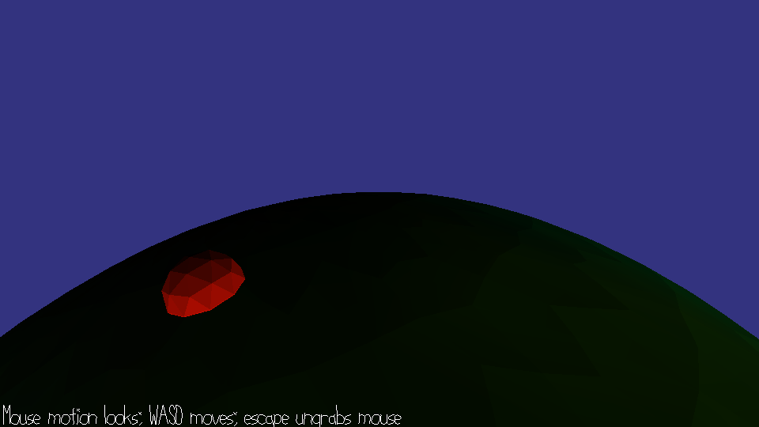

# Planetary Chase

Author: Lawrence Chen

Design: You are standing on planet and must find and destroy all red spheres that are moving around it.

Screen Shot:

How To Play:
WASD to move, mouse to look around. Stand on a red ball to destroy it.

Unfortunately, I could not get the blender scene for this game correct. There is something wrong with the normals that can cause the player/balls to fly off the planet. Recomputing vertex normals did not help. :(

Sources: (TODO: list a source URL for any assets you did not create yourself. Make sure you have a license for the asset.)

This game was built with [NEST](NEST.md).

